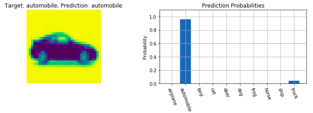
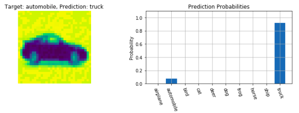
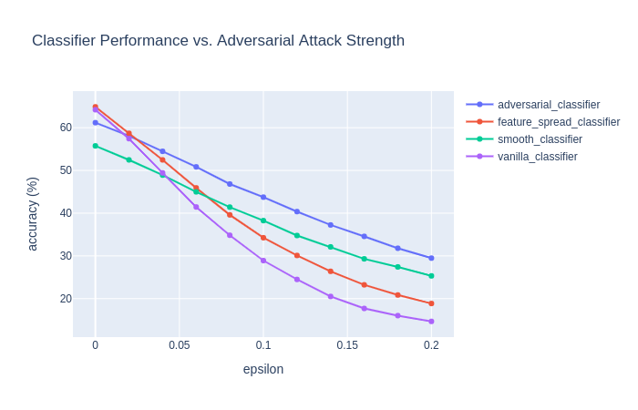

# adversarial-samples
Exploration of adversarial samples generated for a CNN classifier.

|  |
| :-: |
|  |
| *Sample from CIFAR-10 dataset with classifier prediction before and after being altered for a model attack.* |

### Environment:

Python 3.8.5

### Python Packages:

```
$ pip install -r requirements.txt
```

### Image Dataset Format:

This project assumes you have the CIFAR-10 dataset pre-configured locally on your machine in the format described below. My [dataset-helpers](https://github.com/dylanell/dataset-helpers) Github project also contains tools that perform this local configuration automatically within the `cifar` directory of the project.

The CIFAR-10 dataset contains images of several different animals and objects including dogs, cats, automobiles, trucks, etc. Full information about the dataset, including download links can be found on the [CIFAR homepage](https://www.cs.toronto.edu/~kriz/cifar.html). We organize the dataset into training/testing directories of raw image files (`png` or `jpg`) accompanied by a `csv` file listing one-to-one correspondences between the image file names and their label. This "generic image dataset format" is summarized by the directory tree structure below.

```
dataset_directory/
|__ train_labels.csv
|__ test_labels.csv
|__ train/
|   |__ train_image_01.png
|   |__ train_image_02.png
|   |__ ...
|__ test/
|   |__ test_image_01.png
|   |__ test_image_02.png
|   |__ ...   
```

Each labels `csv` file has the format:

```
Filename, Label
train_image_01.png, 4
train_image_02.png, 7
...
```

If you would like to re-use the code here to work with other image datasets, just format any new image dataset to follow the outline above and be sure to edit corresponding hyperparameters in the `config.yaml` file.

### Training:

Training options and hyperparameters are pulled from the `config.yaml` file and can be changed by editing the file contents. The `train.py` script accepts only several specific values for the `model_type` variable in `config.yaml` corresponding to the type of classifier you would like to train from the `model` directory in this project. When the `adversary` variable is `False`, the training script uses the second half of the training data split as training data and when the `adversary` variable is `True`, it uses the first half of the training data split. Again, this is to simulate the scenario where an adversarial attacker does not have access to the exact data used to train the model wished to be attacked.

When `config.yaml` contains your desired configuration values, train a classifier by running:

```
$ python train.py
```

### Jupyter Notebook:

This project is accompanied by a Jupyter notebook that explains some of the theory behind generating adversarial samples using the Fast Gradient Sign Method (FGSM) as well as some analysis of how several models perform on adversarial samples.

|  |
| :-: |
| *Accuracy of several classifier models as adversarial attack strength increases.* |

Run the following command to start the Jupyter notebook server in your browser:

```
$ jupyter-notebook notebook.ipynb
```

### References:

1. Adversarial Samples:
  * https://arxiv.org/pdf/1312.6199.pdf
2. Adversarial Training:
  * https://arxiv.org/pdf/1412.6572.pdf
3. Smoothing Defense:
  * https://arxiv.org/pdf/1902.02918.pdf%5D
4. Distillation Defense:
  * https://arxiv.org/pdf/1511.04508.pdf
5. Feature Space Defense:
  * https://arxiv.org/pdf/1904.00887.pdf
6. Silhouette Coefficient:
  * https://scikit-learn.org/stable/modules/clustering.html#clustering-performance-evaluation
